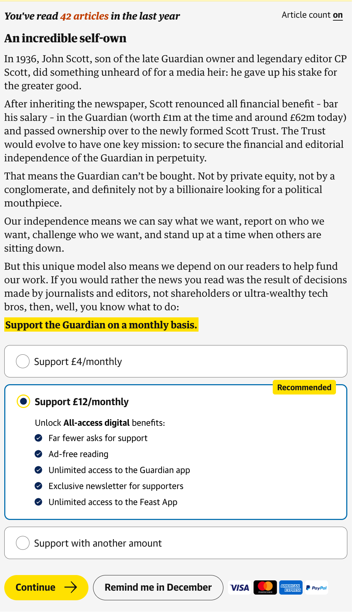
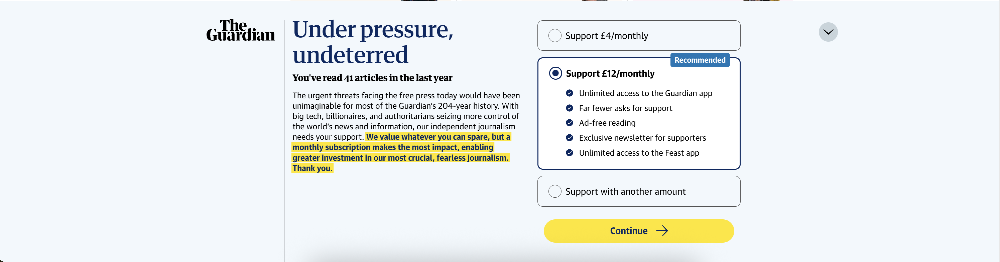

Testing Reader Revenue Components
====================================

## tl;dr

- Check out these functions! https://github.com/guardian/dotcom-rendering/blob/main/dotcom-rendering/src/lib/readerRevenueDevUtils.ts
- Check out Bookmarklets in RRCP

## Components

www.theguardian.com is the main driver of traffic for our reader revenue sites, in particular support.theguardian.com where sign-ups for one-off and recurring contributions occur.

The components which drive the most traffic are:

### The epic
- Sits in the document flow, at the bottom of article copy in articles and within the document flow of liveblogs
- Typically only displays for a certain number of views in a given time window (normally 4 in 30 days) ***STILL RELEVANT?***
- Won't display if the user is a signed in Recurring Contributor or is a Subscriber (important note: whether or not you are signed in has **no bearing** on the epic being shown if you have made a **one-off contribution**) ***STILL RELEVANT?***
- Won't display if the browser has a **recurring contribution cookie**
- Won't display if the broswer has a **one-off contribution cookie** from within the **last 6 months**
- Won't display on pages which have the `window.guardian.config.page.shouldHideReaderRevenue` flag set (this is set by editorial in Composer)



### The engagement banner
- Is a fixed position banner at the bottom of the screen (like the breaking news banner, cookie consent banner, etc)
- Only displays after a certain number of pageviews ***STILL RELEVANT?***
- Will not re-display after it's closed, until we "redeploy" (globally force a re-display) via this tool: https://frontend.gutools.co.uk/reader-revenue/contributions-banner
- Won't display if the user is a signed in Recurring Contributor or Digipack Subscriber (important note: whether or not you are signed in has **no bearing** on the epic being showed if you have made a one-off contribution) ***STILL RELEVANT?***
- Won't display if the browser has a **recurring contribution cookie**
- Won't display if the browser has a **one-off contribution cookie** from within the **last 6 months**
- Won't display on pages which have the `window.guardian.config.page.shouldHideReaderRevenue` flag set (this is set by editorial in Composer)



## Why can't I see the epic or banner?
- The rules which determine whether these display on a given pageview are complex enough that getting them to display can be a pain
- On top of this, we are almost always running tests on these components which means there are different variants in production
- And on top of that, we often have region-specific copy, either as a test or simply as a region-specific control
- Typically when making changes to these components, you will want to double-check all variants in our main regions (US, UK, Australia)
- Won't display on pages which have the `window.guardian.config.page.shouldHideReaderRevenue` flag set (this is set by editorial in Composer)
- Finally, the sign-in gate might be blocking the banner from loading or covering the epic

## Helper functions
We have some helper functions, exposed on `window.guardian.readerRevenue`, which can help with this problem.

```javascript

    window.guardian.readerRevenue = {
        showMeTheEpic,
        showMeTheBanner,
        showMeTheDoubleBanner,
        showNextVariant,
        showPreviousVariant,
        changeGeolocation,
    };

```
All of these accept no arguments and return nothing.
They will ensure that all cookies and localStorage items are set up correctly, and reload the page.

See here for code and additional comments: https://github.com/guardian/dotcom-rendering/blob/main/dotcom-rendering/src/lib/readerRevenueDevUtils.ts

## Bookmarklets
You can call those functions from the console if you like but if you want to use them as handy bookmarklets, you can find them under Bookmarklets in RRCP.
